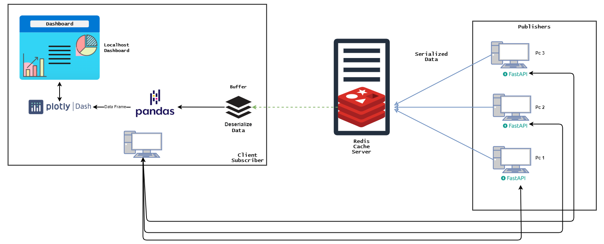

# ThisPc

*Monitor the performance and system resources of multiple computers remotely through a live dashboard*

ThisPc is a project/proof of concept, developed to monitor the system recourses and performance of remote PCs, through a live web-based dashboard hosted locally.
## Appendix
[ThisPC-API](https://github.com/Goldenboycoder/this-pc-api): installed on PCs to monitor.

[ThisPC-Client](https://github.com/Goldenboycoder/this-pc-client): installed on the PC to monitor with.

## Features

- Monitor CPU performance metrics: frequency, Cores utilization and general CPU load for the past 15 min.
- Monitor Memory usage.
- Monitor Network Input/Output.
- Monitor storage capacity.
- Dashboard live updates, using a Publisher/Subscriber architecture with Redis.
- Individual PC API endpoint (FastAPI) to query advanced details about a PC, with an interactive API documentation (OpenAPI).


  
## How it works!




Each Pc you need to monitor needs to have [ThisPC-API](https://github.com/Goldenboycoder/this-pc-api) running, which will regularly publish performance data to the Redis server under the PC-<PcName> channel.

To be able to monitor the PCs, an instance of [ThisPC-Client](https://github.com/Goldenboycoder/this-pc-client) needs to be running on your local machine.

Once launched and after a few seconds navigate to your browser and visit:
```Localhost:8050```

The Dashboard will then be visible (if not refresh the page a few times).

Every few seconds the dashboard will consume the data received from the Redis pattern subscription (PC-*) and update the web-based dashboard with the new data.

The Redis server needs to be hosted on a separate machine (not necessary but advised). 


  
## Tech Stack

The Project is mostly done using Python

**[ThisPC-Client](https://github.com/Goldenboycoder/this-pc-client)** Redis-py, Plotly-Dash, Pandas

**[ThisPC-API](https://github.com/Goldenboycoder/this-pc-api):** FastAPI, Redis-py

  
## Lessons Learned

- Publisher/Subscriber architecture
- API workings
- Redis workings
- I'm 200% sure now that I don't like front-end development
  
## Author

- [@Patrick Balian](https://github.com/Goldenboycoder)

  